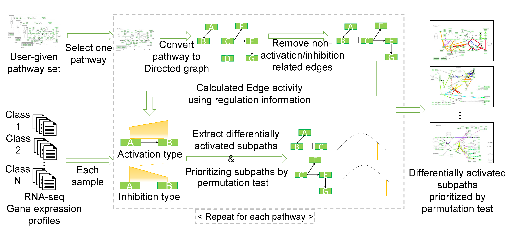

# About MIDAS

MIDAS is a software tool that determines differentially activated subpaths from multi-class RNA-seq data. 



# Highrights

* MIDAS utilizes explicit gene expression quantity information from RNA-seq.
* MIDAS extends a recent edge activation measurement technique for determining subpaths with differential activities.
* MIDAS uses the multi-class issue in a statistical approach.
* MIDAS uses a greedy subpath extension method with  exponentially increasing criteria.


# Installation

MIDAS is implemented in with Bash scripts, [R](https://www.r-project.org/), and [Python](https://www.python.org/) libraries. Belows are requirements for MIDAS.

## Requirements

* Python: 2.7
* Networkx: over 1.10 (https://networkx.github.io/index.html)
* scipy: over 0.17.1 (https://www.scipy.org/)
* Statsmodels: over 0.6.1 (http://www.statsmodels.org/0.6.1/index.html)
* matplotlib: over 1.5.1 (http://matplotlib.org/)
* R: over 3.0.2

# Usage

First, clone the repository or download compressed source code files.
```
$ git clone https://github.com/bhi-kimlab/MIDAS.git
$ cd MIDAS
```
You can see the valid paramenters for MIDAS by help option:
```
$ bash ./run.sh --help
```
One example of parameter setting is like:
```
$ bash run.sh \
		 --expression ./test_data/total_exp.MGD \
		 --pathway_set ./test_data/pathway_set.txt \
		 --class_info ./test_data/total_exp.MGD.sample_class.txt \
		 --output_directory ./test_result/ \
		 --start_threshold 0.05 \
		 --increase_moment 1e-15 \
		 --permutation_cutoff 0.1 \
		 --permutation_number 100000 \
		 --parallel_cores 10
```
You can run MIDAS with test data:
```
cd test
bash ./test_run.sh
```

# Contact
If you have any question or problem, please send a email to [sangseon486@snu.ac.kr](mailto:sangseon486.snu.ac.kr)


